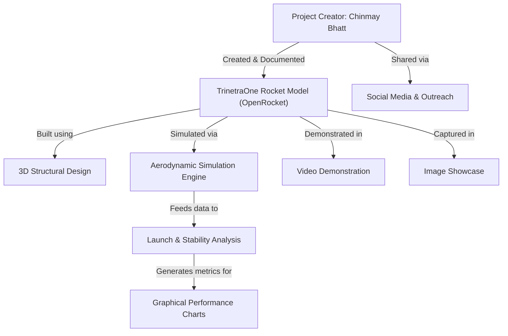

# TrinetraOne - OpenRocket

## TrinetraOne: Rocket Project Overview

**TrinetraOne** is a custom-designed rocket created using the OpenRocket simulation software. This project demonstrates the capabilities of advanced rocket simulations and design.
 
 Showcases a virtual rocket model built with precision, designed for optimal aerodynamics and high performance. This project highlights the integration of modern tools in rocket science.

---

    

## Visual Showcase

## Video Showcase

Watch the rocket design and simulation in action:  

---

## Project Details

Here are some of the key highlights of the TrinetraOne project:

- **Software Used:** OpenRocket
- **Rocket Design Objective:** Simulating a highly aerodynamic and stable model.
- **Key Features:**
  1. Virtual 3D modeling of the rocket structure.
  2. Launch simulations with step-by-step analysis.
  3. Graphical performance metrics including stability and velocity charts.
- **Outcome:** A functional and simulated-ready rocket design, TrinetraOne is a proof-of-concept for virtual aerodynamics.

---

## Rocket Images
Below are visuals from the project:

  

---

## About the Creator and Social Media Links

**Why TrinetraOne?**
- Inspired by the speed, power, and futuristic appeal of lightning, the name represents the cutting-edge design and performance of this virtual rocket.

**About Me:**
Hi, I’m Chinmay Bhatt, a tech enthusiast and aspiring space engineer. I created TrinetraOne to explore the possibilities of rocket design and simulation using OpenRocket. This project is my step towards mastering rocket science.

## 🔗 Connect With Me:
  

